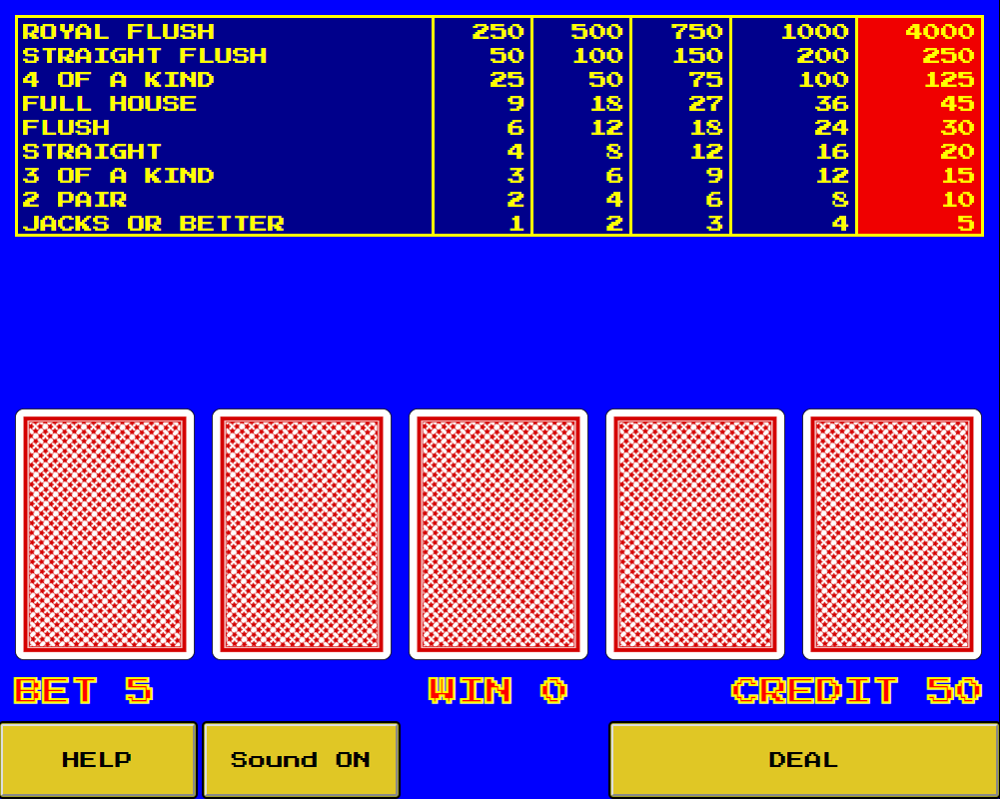

# Video Poker

> A "9-6 Jacks or Better" video poker game built using React and Redux. It's free to play!

[![NPM Version][npm-image]][npm-url]
[![Build Status][travis-image]][travis-url]




## How to play

Visit [https://keyeh.io/videopoker](https://keyeh.io/videopoker) to play.

Press the Deal button and select the cards you want to hold. Then press deal again to see if you won.

You automatically bet 5 credits each time. Once you hit zero credits it'll go negative -- there's infinite credits. Or refresh the page to reset to 50 credits.

_For a simple strategy, please refer to the [Wizard of Odds page](https://wizardofodds.com/games/video-poker/strategy/jacks-or-better/9-6/simple/).

## Development setup

Requires Node.JS and Yarn

```sh
git clone https://github.com/keyeh/videopoker.git
yarn install
npm run
```

## Release History

-   0.2.1
    -   CHANGE: Update docs (module code remains unchanged)
-   0.2.0
    -   CHANGE: Remove `setDefaultXYZ()`
    -   ADD: Add `init()`
-   0.1.1
    -   FIX: Crash when calling `baz()` (Thanks @GenerousContributorName!)
-   0.1.0
    -   The first proper release
    -   CHANGE: Rename `foo()` to `bar()`
-   0.0.1
    -   Work in progress

## Contributing

1. Fork it (<https://github.com/yourname/yourproject/fork>)
2. Create your feature branch (`git checkout -b feature/fooBar`)
3. Commit your changes (`git commit -am 'Add some fooBar'`)
4. Push to the branch (`git push origin feature/fooBar`)
5. Create a new Pull Request

## License

MIT License

Copyright (c) 2018 Kevin Yeh

Permission is hereby granted, free of charge, to any person obtaining a copy
of this software and associated documentation files (the "Software"), to deal
in the Software without restriction, including without limitation the rights
to use, copy, modify, merge, publish, distribute, sublicense, and/or sell
copies of the Software, and to permit persons to whom the Software is
furnished to do so, subject to the following conditions:

The above copyright notice and this permission notice shall be included in all
copies or substantial portions of the Software.

THE SOFTWARE IS PROVIDED "AS IS", WITHOUT WARRANTY OF ANY KIND, EXPRESS OR
IMPLIED, INCLUDING BUT NOT LIMITED TO THE WARRANTIES OF MERCHANTABILITY,
FITNESS FOR A PARTICULAR PURPOSE AND NONINFRINGEMENT. IN NO EVENT SHALL THE
AUTHORS OR COPYRIGHT HOLDERS BE LIABLE FOR ANY CLAIM, DAMAGES OR OTHER
LIABILITY, WHETHER IN AN ACTION OF CONTRACT, TORT OR OTHERWISE, ARISING FROM,
OUT OF OR IN CONNECTION WITH THE SOFTWARE OR THE USE OR OTHER DEALINGS IN THE
SOFTWARE.

<!-- Markdown link & img dfn's -->

[npm-image]: https://img.shields.io/npm/v/datadog-metrics.svg?style=flat-square
[npm-url]: https://npmjs.org/package/datadog-metrics
[npm-downloads]: https://img.shields.io/npm/dm/datadog-metrics.svg?style=flat-square
[travis-image]: https://img.shields.io/travis/dbader/node-datadog-metrics/master.svg?style=flat-square
[travis-url]: https://travis-ci.org/dbader/node-datadog-metrics
[wiki]: https://github.com/yourname/yourproject/wiki
